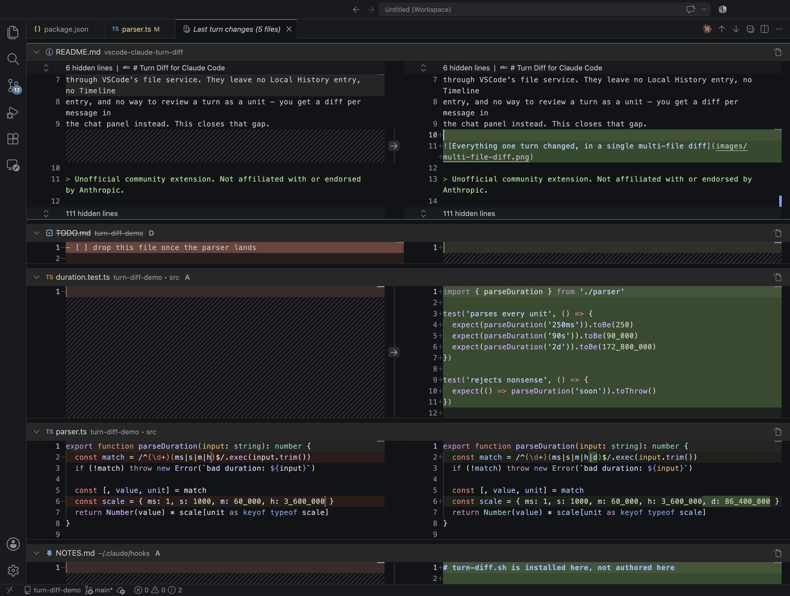

# Turn Diff for Claude Code

Shows everything Claude Code changed during one turn as a **single multi-file
diff editor**, opened automatically when the turn ends.

Claude Code's CLI writes files straight to disk, so its edits never pass
through VSCode's file service. They leave no Local History entry, no Timeline
entry, and no way to review a turn as a unit — you get a diff per message in
the chat panel instead. This closes that gap.



> Unofficial community extension. Not affiliated with or endorsed by Anthropic.

## What you get

- **One tab per turn**, not one per file. Every changed file in a single
  scrollable multi-file diff, with per-file collapse.
- **Editable in place.** The right-hand side is the real file, so the *Revert
  block* arrows work — reviewing and undoing happen in the same view.
- **Every repo in the workspace.** A turn touching two repos in a multi-root
  workspace produces one diff listing both.
- **Files outside any repo too.** Edits to something in `~/.claude` or a
  scratch directory still show up.
- **Script-driven edits are caught.** An `rm`, `sed`, formatter run or
  `package-lock.json` churn from a shell command appears just like a direct
  edit — anything landing in a git worktree is seen, however it got there.
- **`A` / `M` / `D` badges**, with no spurious rename markers.

## Requirements

- [Claude Code for VS Code](https://marketplace.visualstudio.com/items?itemName=anthropic.claude-code)
- macOS or Linux. On Windows, use WSL or Git Bash.

## Install

Install the extension, then accept the prompt to register its hooks in
`~/.claude/settings.json`. A backup is written to
`settings.json.turn-diff-backup` first.

The extension also installs the hook script it ships with to
`~/.claude/hooks/turn-diff.sh`, and keeps it in step on upgrade.

Claude Code reads hooks at session start, so **reload the window** afterwards.

Prefer to do it by hand? Run **Turn Diff: Register hooks in Claude settings**
from the palette, or add this yourself:

```json
{
  "hooks": {
    "UserPromptSubmit": [
      { "hooks": [{ "type": "command", "command": "\"$HOME\"/.claude/hooks/turn-diff.sh begin", "timeout": 10 }] }
    ],
    "PreToolUse": [
      {
        "matcher": "Edit|Write|MultiEdit|NotebookEdit|Bash",
        "hooks": [{ "type": "command", "command": "\"$HOME\"/.claude/hooks/turn-diff.sh arm", "timeout": 15 }]
      }
    ],
    "Stop": [
      { "hooks": [{ "type": "command", "command": "\"$HOME\"/.claude/hooks/turn-diff.sh end", "timeout": 30 }] }
    ],
    "StopFailure": [
      { "hooks": [{ "type": "command", "command": "\"$HOME\"/.claude/hooks/turn-diff.sh end", "timeout": 30 }] }
    ]
  }
}
```

## Commands

| Command | Does |
|---|---|
| Turn Diff: Show last turn changes | Reopens the last diff, skipping anything since reverted |
| Turn Diff: Register hooks in Claude settings | Writes the hook config, after a backup |
| Turn Diff: Remove hooks from Claude settings | Removes only this extension's entries |

## How it works

| Hook | Runs | Does |
|---|---|---|
| `UserPromptSubmit` | you hit enter | clears anything an interrupted turn left. No git. |
| `PreToolUse` | first write-capable tool of the turn | snapshots every git repo in the workspace to dangling tree objects |
| `PreToolUse` | every `Edit`/`Write` naming a path | if that path is outside all those repos, copies its before-image |
| `Stop` | Claude finishes | diffs and opens the editor |
| `StopFailure` | the turn dies on an API error | the same, so the work still gets a diff |

Snapshots use a throwaway copy of `.git/index`, so your real index and staging
area are never touched.

The hook is a thin client. It locates the window serving this project through a
small file under `~/.claude/turn-diff/` and hands the payload over a loopback
socket, so the capture runs inside the extension rather than in an interpreter
re-spawned before every tool call. Later `PreToolUse` calls cost one round trip
of a few milliseconds, and a turn that writes nothing never spawns git at all.
If no window is serving the project, the hook exits without doing the work —
there would be nothing to render it.

Two mechanisms, because neither suffices alone: **tree snapshots** catch
anything happening inside a git worktree however it happened, but cannot see
outside a repo; **per-file capture** catches paths outside every repo, but only
when a tool names them.

## Storage

Before-images live in `~/.claude/turn-diff/`, and only the most recent turn is
kept — each turn purges the last. The diff compares against the *current* file,
which is what makes it editable, so an older turn stops being meaningful the
moment the tree moves on.

## Limitations

- **Untracked** files over 1MB are excluded from snapshots — from both sides,
  so they cancel out and never appear.
- Gitignored files do not appear unless an `Edit`/`Write` tool named them
  directly. Already-tracked files always appear, ignore rules notwithstanding.
- A shell command writing **outside** every repo is caught by neither
  mechanism.
- Binary files are not shown. The multi-file diff editor resolves both sides
  through VS Code's text model service, so a binary entry cannot render, and
  there is no image diff to fall back on.
- Paths containing tabs or newlines are not handled.

## License

MIT
