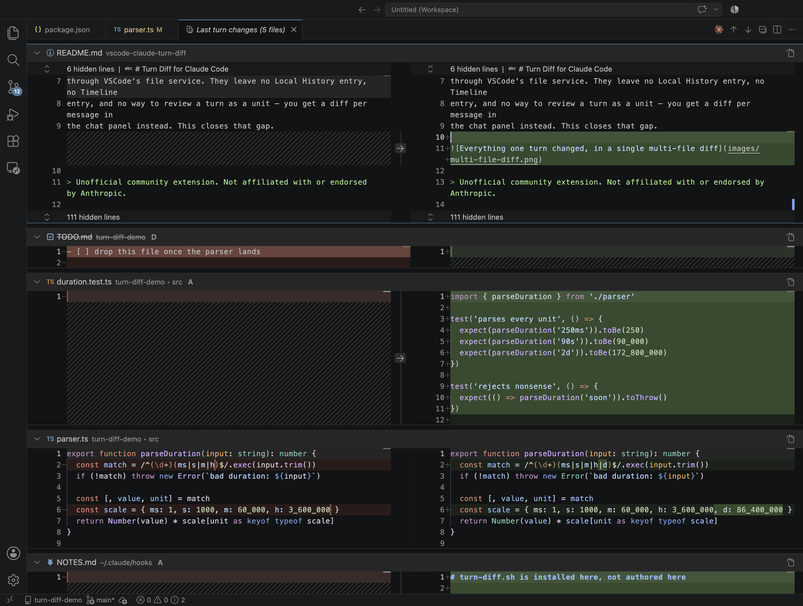

# Turn Diff for Claude Code

Shows everything Claude Code changed during one turn as a **single multi-file diff editor**, opened automatically when the turn ends.

Claude Code writes files straight to disk, so its edits never pass through VS Code's file service. They leave no Local History entry and no Timeline entry, and there is no way to review a turn as a unit. You get a diff per message in the chat panel instead. This extension closes that gap.



> Unofficial community extension. Not affiliated with or endorsed by Anthropic.

## What you get

- **One tab per turn**, not one per file. Every changed file in a single scrollable multi-file diff, with per-file collapse.

- **Editable in place.** The right-hand side is the real file, so the *Revert block* arrows work. Reviewing and undoing happen in the same view.

- **Every repo in the workspace.** A turn touching two repos in a multi-root workspace produces one diff listing both.

- **Files outside any repo too.** Edits to something in `~/.claude` or a scratch directory still show up.

- **Script-driven edits are caught.** An `rm`, `sed`, formatter run or `package-lock.json` churn from a shell command appears just like a direct edit. Anything landing in a git worktree is seen, however it got there.

- **`A` / `M` / `D` badges**, and a moved file shows as a rename.

- **A look at work in progress.** Ask for the diff while Claude is still working and you get what the turn has changed so far, brought up to date each time you ask.

## Requirements

- [Claude Code for VS Code](https://marketplace.visualstudio.com/items?itemName=anthropic.claude-code), 2.1.196 or newer

- git 2.38 or newer. With an older git, changes inside a repository are not picked up.

- macOS or Linux. On Windows, use WSL or Git Bash.

## Install

Install the extension, then accept the prompt to register its hooks in `~/.claude/settings.json`. A backup is written to `settings.json.turn-diff-backup` first.

The extension also installs the hook script it ships with to `~/.claude/hooks/turn-diff.sh`, and updates it on upgrade.

Claude Code reads hooks at session start, so **reload the window** afterwards.

Prefer to do it by hand? Run **Turn Diff: Register hooks in Claude settings** from the palette, or add this yourself:

```json
{
  "hooks": {
    "UserPromptSubmit": [
      { "hooks": [{ "type": "command", "command": "\"$HOME\"/.claude/hooks/turn-diff.sh begin", "timeout": 10 }] }
    ],
    "PreToolUse": [
      {
        "hooks": [{ "type": "command", "command": "\"$HOME\"/.claude/hooks/turn-diff.sh arm", "timeout": 15 }],
        "matcher": "Edit|Write|MultiEdit|NotebookEdit|Bash"
      }
    ],
    "Stop": [
      { "hooks": [{ "type": "command", "command": "\"$HOME\"/.claude/hooks/turn-diff.sh end", "timeout": 30 }] }
    ],
    "StopFailure": [
      { "hooks": [{ "type": "command", "command": "\"$HOME\"/.claude/hooks/turn-diff.sh end", "timeout": 30 }] }
    ]
  }
}
```

## Commands

| Command | Does |
|---|---|
| Turn Diff: Show last turn changes | The turn in progress if there is one, otherwise the last one that finished. Skips anything since reverted |
| Turn Diff: Register hooks in Claude settings | Writes the hook config, after a backup |
| Turn Diff: Remove hooks from Claude settings | Removes only this extension's entries |

## How it works

| Hook | Runs | Does |
|---|---|---|
| `UserPromptSubmit` | you hit enter | clears anything an interrupted turn left. No git. |
| `PreToolUse` | first write-capable tool of the turn | snapshots every git repo in the workspace to dangling tree objects |
| `PreToolUse` | every `Edit`/`Write` naming a path | if that path is outside all those repos, copies the file aside |
| `Stop` | Claude finishes | diffs and opens the editor |
| `StopFailure` | the turn dies on an API error | the same, so the work still gets a diff |

Snapshots use a throwaway copy of `.git/index`, so your real index and staging area are never touched.

Asking for the diff mid-turn compares that same snapshot with the files as they are now, without ending the turn. It is a look at the work in progress, not a checkpoint of it. If the turn turns out to be over already, asking finishes it off, and you get an ordinary last-turn diff.

The hook is a small bash script. It finds the window serving this project through a file under `~/.claude/turn-diff/` and hands the payload to the extension over a loopback socket, so the capture runs inside the extension. A `PreToolUse` call costs a few milliseconds, and a turn that writes nothing never runs git. If no window serves the project, the hook exits without doing anything, since nothing could show the result.

Two mechanisms, because neither is enough alone: **tree snapshots** catch anything happening inside a git worktree, however it happened, but cannot see outside a repo; **per-file capture** catches paths outside every repo, but only when a tool names them.

[TECHNICAL.md](TECHNICAL.md) explains why the internals are shaped the way they are, the parts you cannot tell from reading the source.

## Storage

Before-images live in `~/.claude/turn-diff/<project>/`, and only the most recent turn is kept. Each turn replaces the last. The diff compares against the *current* file, which is what makes it editable, so an older turn stops being meaningful once the tree moves on.

A diff you already have open keeps working after a later turn replaces it, because the editor holds on to the text it has read, but only until you close the tab or reload the window.

## Limitations

- Untracked files over 1 MB are left out of both snapshots, so they never appear.

- Gitignored files inside a repo do not appear, even when an `Edit`/`Write` tool named them. Already-tracked files always appear, whatever the ignore rules say.

- A shell command writing outside every repo is caught by neither mechanism.

- Binary files are not shown. The multi-file diff editor resolves both sides through VS Code's text model service, so a binary entry cannot render, and there is no image diff to fall back on.

- A turn you interrupt opens no diff by itself, because Claude Code runs no `Stop` hook for it. Run **Turn Diff: Show last turn changes** to finish it off and get its diff. Do that before your next message, which discards the turn's baseline. The same recovers a turn that ended while the window was closed or reloading.

- A turn that dies outright, with the window killed, a crash, or the connection lost mid-reply, leaves nothing to tell it apart from one still working, so it cannot be recovered this way.

- One window serves a project at a time, whichever you last focused. VS Code will not open the same folder twice, so two windows on one project take some arranging. If you manage it, the diff opens by itself only in the window that was focused when the turn ended. The other can still show it from the palette.

- Two chats running at once in the same project share one diff. The second reuses the first's baseline and produces nothing of its own. A snapshot covers the whole workspace anyway, so each would have shown the other's edits.

- Paths containing tabs or newlines are not handled.

## License

MIT
